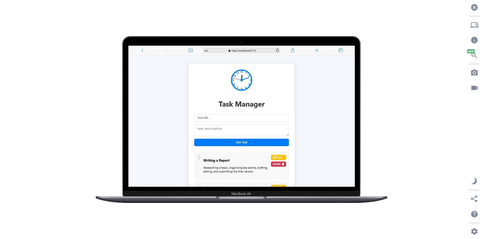
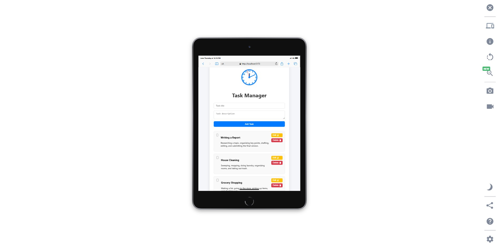
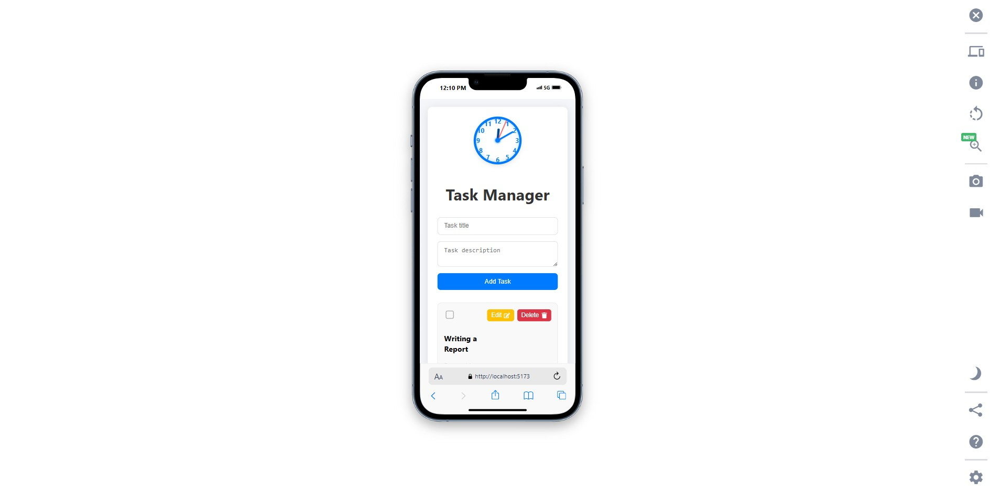

# 📝 Task Manager App

A full-stack task management application built using **React**, **Express.js**, and **MongoDB**, featuring an animated clock, editable tasks, modal-based delete confirmations, and persistent task storage.

---

## 🔗 Live Demo

👉 [View Live Demo Here](https://task-manager-fe-flame.vercel.app/)

---

## 📸 Screenshots

### 💻 Laptop View



### 📱 Tablet View



### 📞 Mobile View



---

## 🚀 Features

- ✅ Add, edit, and delete tasks
- ✅ Mark tasks as completed
- ✅ Stylish modal confirmation for deletions
- ✅ Persistent backend with MongoDB
- ✅ Animated live clock 
- ✅ Responsive and modern UI using React and CSS

---

## 📦 Technologies Used

### Frontend:
- React + TypeScript
- Vite for development bundling
- React Icons
- CSS for styling

### Backend:
- Express.js
- MongoDB + Mongoose
- dotenv and CORS

---

## 🛠️ Installation & Setup

### 1. Clone the Repository

```bash
git clone https://github.com/promisead/task-manager.git
cd task-manager
```

---

### 2. Setup Backend

```bash
cd backend
npm install
```

#### 🔧 Create Environment File

Create a `.env` file in the `/backend` directory with the following content:

```env
PORT=5000
MONGO_URI=mongodb://localhost:27017/taskmanager
```

> ✅ If you're using **MongoDB Atlas**, replace `MONGO_URI` with your connection string. Example:
>
> ```env
> MONGO_URI=mongodb+srv://<username>:<password>@cluster0.mongodb.net/taskmanager?retryWrites=true&w=majority
> ```

#### 📁 Backend Folder Structure Explained

```
backend/
├── src/
│   ├── server.js              # Entry point of the Express app
│   ├── models/
│   │   └── Task.js            # Mongoose model for Task schema
│   ├── controllers/
│   │   └── taskController.js  # Logic for CRUD operations
│   └── routes/
│       └── taskRoutes.js      # API routes for task endpoints
├── .env                       # Environment variables
├── package.json
```

#### 🔄 Start MongoDB Locally

Ensure MongoDB is installed and running locally:

```bash
# For Linux/macOS
sudo service mongod start

# For Windows (via MongoDB Compass or MongoDB Community Edition)
```

#### ▶️ Start the Backend Server

Use nodemon for development:

```bash
npm run dev
```

Or run directly with Node:

```bash
node src/server.js
```

The API should now be running at: [http://localhost:5000](http://localhost:5000)

#### ✅ Available API Endpoints

| Method | Endpoint         | Description           |
|--------|------------------|-----------------------|
| GET    | /api/tasks       | Get all tasks         |
| POST   | /api/tasks       | Add a new task        |
| PUT    | /api/tasks/:id   | Update a task by ID   |
| DELETE | /api/tasks/:id   | Delete a task by ID   |

---

### 3. Setup Frontend

```bash
cd ../frontend
npm install
```

Create a `.env` file in the `/frontend` folder:

```env
VITE_API_URL=http://localhost:5000
```

Start the React development server:

```bash
npm run dev
```

Visit: [http://localhost:5173](http://localhost:5173)

---

## 🧪 Testing the App

- Add a task with a title & description.
- Click the checkbox to mark complete (slashes it out).
- Edit and update a task.
- Delete a task using the modal confirmation.
- Confirm all changes reflect in MongoDB.

---

## 📁 Folder Structure

```
task-manager/
│      
│   
│── backend/              # Express API and MongoDB
│   ├── src/
│   │   ├── server.js
│   │   ├── models
│   │   └── controllers
│   │   └── routes
│   └── .env
│
├── frontend/              # React frontend (Vite + TS)
│   ├── src/
│   │   ├── App.tsx
│   │   ├── App.css
│   │   └── components/
│   │       └── Clock.tsx
│   └── .env
```

---

## ❗ Assumptions

- Tasks must have a title (description optional).
- No authentication—this app is for single-user usage.
- MongoDB is expected to be available via connection string.
- Vite handles React build/development without additional config.

---

## 📄 License

MIT License – feel free to use and modify!

---

## 👤 Author

 Developed by [PROMISE DUKE](https://github.com/promisead)
